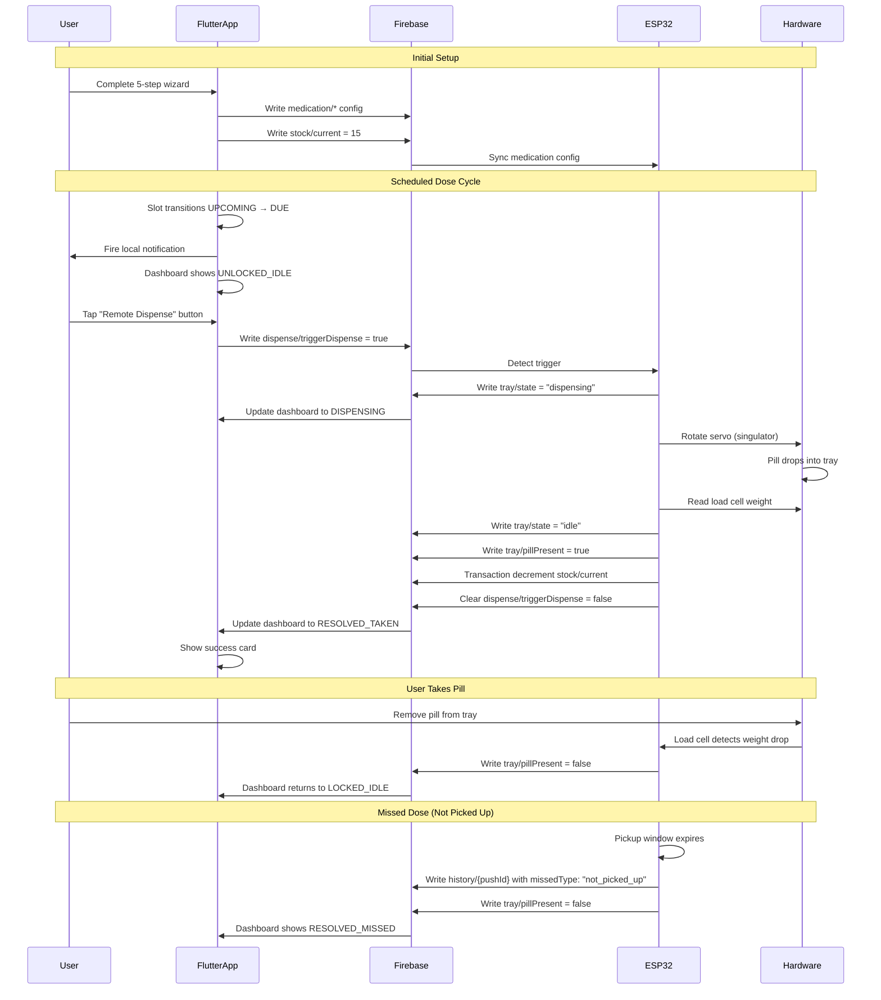
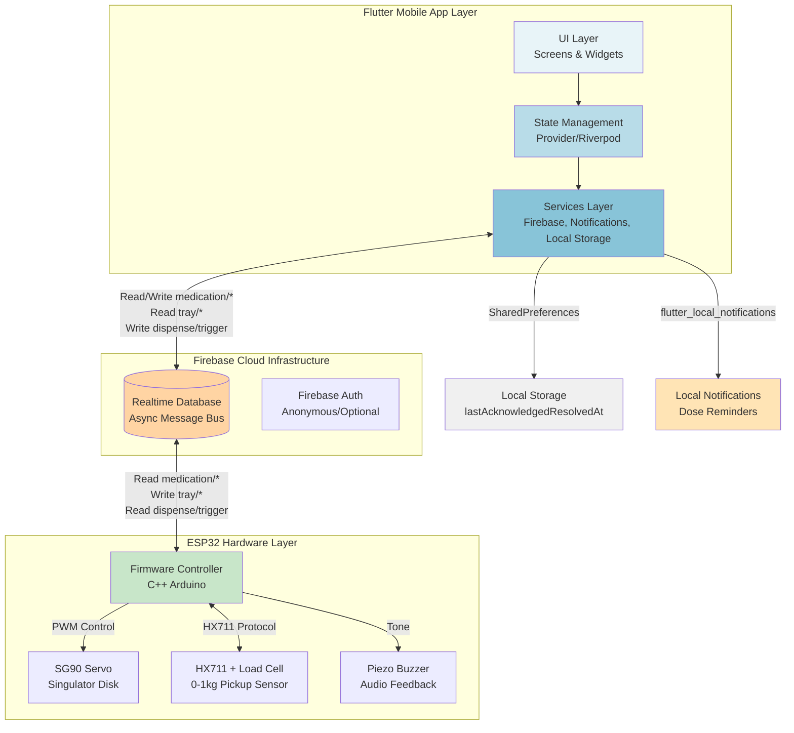

# Design Document: MediTrack Complete System

## Overview

MediTrack is an academic prototype that addresses medication non-adherence through a smart pillbox dispenser system. The system consists of three core components: a Flutter mobile application (control surface and history log), Firebase Realtime Database (async message bus), and an ESP32-powered mechanical pillbox (precise single-pill dispensing with hardware-verified pickup).

The mechanical dispenser uses a servo-driven rotating disk singulator for precise single-pill dispensing and a 0-1kg load cell under the catch tray for hardware-verified pickup confirmation. The Flutter app never communicates directly with the ESP32; all interactions flow through Firebase Realtime Database as an async message bus. The system enforces a single-medication model with 15-pill hopper capacity, supports 1-3 doses per day, handles two types of missed doses (hardware-verified not_picked_up and app-detected not_dispensed), and manages both fixed-duration courses and ongoing medications with active day selection.

Key architectural principles: app-triggered dispensing only (ESP32 never dispenses autonomously), state-driven rendering (dashboard is a pure function of Firebase state), and clear field ownership (medication/* written by app only, tray/* written by ESP32 only).

## Main Algorithm/Workflow



## Architecture



## Components and Interfaces

### Component 1: DashboardScreen (UI)

**Purpose**: Primary interface displaying current system state, next dose timing, remote dispense control, and resolution cards

**Interface**:
```dart
class DashboardScreen extends StatelessWidget {
  const DashboardScreen({Key? key}) : super(key: key);

  @override
  Widget build(BuildContext context) {
    return Consumer<MediTrackState>(
      builder: (context, state, child) {
        final dashboardState = _computeDashboardState(state);
        return Scaffold(
          body: _buildForState(dashboardState, state),
        );
      },
    );
  }
  
  DashboardStateEnum _computeDashboardState(MediTrackState state);
  Widget _buildForState(DashboardStateEnum ds, MediTrackState state);
}

enum DashboardStateEnum {
  notConfigured,
  lockedIdle,
  unlockedIdle,
  dispensing,
  resolvedTaken,
  resolvedMissed,
  courseCompleted,
}
```

**Responsibilities**:
- Pure function rendering based on Firebase state + local lastAcknowledgedResolvedAt
- Compute current dashboard state from medication config, tray state, schedule slots, course completion
- Render appropriate UI: onboarding, dispense button (locked/unlocked), resolution cards, course completed
- Handle user acknowledgment of resolution cards (update local storage)
- Navigate to History or Wizard screens

### Component 2: WizardScreen (UI)

**Purpose**: 5-step guided setup flow for medication configuration

**Interface**:
```dart
class WizardScreen extends StatefulWidget {
  final MedicationConfig? existingConfig; // null for first-time, non-null for edit
  const WizardScreen({Key? key, this.existingConfig}) : super(key: key);
  
  @override
  State<WizardScreen> createState() => _WizardScreenState();
}

class _WizardScreenState extends State<WizardScreen> {
  int _currentStep = 0;
  late MedicationConfig _draftConfig;
  
  void _nextStep();
  void _prevStep();
  Future<void> _saveConfiguration() async;
  
  @override
  Widget build(BuildContext context) {
    return Scaffold(
      body: Stepper(
        currentStep: _currentStep,
        steps: _buildSteps(),
        onStepContinue: _nextStep,
        onStepCancel: _prevStep,
      ),
    );
  }
  
  List<Step> _buildSteps() {
    return [
      _buildMedicationDetailsStep(),      // Step 0
      _buildPillInventoryStep(),          // Step 1
      _buildDosingScheduleStep(),         // Step 2
      _buildCourseLengthStep(),           // Step 3
      _buildPickupWindowStep(),           // Step 4
    ];
  }
}
```

**Responsibilities**:
- Collect medication name, dosage strength
- Pill inventory stepper (capped at 15 pills)

- Dosing schedule configuration (1-3 alarm times per day)
- Course type selection (ongoing with active days vs fixed-duration)
- Pickup window and grace period configuration
- Full snapshot save to Firebase (never patch updates)
- Mid-course edit safety: block during dispensing, forward-only schedule changes

### Component 3: HistoryScreen (UI)

**Purpose**: Display medication adherence history with filtering and weekly summary

**Interface**:
```dart
class HistoryScreen extends StatefulWidget {
  const HistoryScreen({Key? key}) : super(key: key);
  
  @override
  State<HistoryScreen> createState() => _HistoryScreenState();
}

class _HistoryScreenState extends State<HistoryScreen> {
  HistoryFilter _filter = HistoryFilter.all;
  DateRange _dateRange = DateRange.sevenDays;
  
  @override
  Widget build(BuildContext context) {
    return Consumer<HistoryState>(
      builder: (context, historyState, child) {
        final filtered = _applyFilters(historyState.events, _filter, _dateRange);
        final weeklyAdherence = _computeWeeklySummary(historyState.events);
        
        return Scaffold(
          body: Column(
            children: [
              WeeklySummaryCard(adherencePercentage: weeklyAdherence),
              SegmentedControl(
                selected: _filter,
                options: [HistoryFilter.all, HistoryFilter.taken, HistoryFilter.missed],
                onChanged: (f) => setState(() => _filter = f),
              ),
              DateRangeSelector(
                selected: _dateRange,
                options: [DateRange.sevenDays, DateRange.thirtyDays, DateRange.all],
                onChanged: (d) => setState(() => _dateRange = d),
              ),
              Expanded(
                child: HistoryList(events: filtered),
              ),
            ],
          ),
        );
      },
    );
  }
}

enum HistoryFilter { all, taken, missed }
enum DateRange { sevenDays, thirtyDays, all }
```

**Responsibilities**:
- Display weekly adherence percentage
- Segmented control filtering (All/Taken/Missed)
- Date range selector (7/30/All days)
- Chronological list of history events with timestamps
- Visual distinction for taken vs missed doses
- Missed dose type indicators (hardware-verified vs app-detected)

### Component 4: FirebaseService (Services Layer)

**Purpose**: Abstract Firebase Realtime Database interactions and provide reactive streams

**Interface**:
```dart
class FirebaseService {
  final DatabaseReference _dbRef;
  
  FirebaseService(this._dbRef);
  
  // Medication configuration
  Stream<MedicationConfig?> watchMedicationConfig();
  Future<void> saveMedicationConfig(MedicationConfig config);
  
  // Stock management
  Stream<int> watchStockLevel();
  Future<void> updateStockLevel(int newLevel);
  
  // Dispense control
  Stream<bool> watchDispenseTrigger();
  Future<void> triggerDispense();
  Future<void> clearDispenseTrigger();
  
  // Tray state
  Stream<TrayState> watchTrayState();
  
  // Device connectivity
  Stream<DeviceConnectionState> watchDeviceConnection();
  
  // History
  Stream<List<HistoryEvent>> watchHistory();
  Future<void> addHistoryEvent(HistoryEvent event);
}

class MedicationConfig {
  final String name;
  final String dosageStrength;
  final List<String> alarmTimes; // ["08:00", "14:00", "20:00"]
  final CourseType courseType;
  final int? durationDays; // non-null for fixed
  final List<int>? activeDays; // non-null for ongoing [1,2,3,4,5] = Mon-Fri
  final int missedWindowMinutes;
  final int pickupGraceMinutes;
  final DateTime createdAt;
}

enum CourseType { ongoing, fixed }

class TrayState {
  final String state; // "idle" | "dispensing"
  final bool pillPresent;
  final DateTime lastUpdated;
}

class DeviceConnectionState {
  final bool connected;
  final DateTime lastSeen;
}

class HistoryEvent {
  final String id;
  final DateTime timestamp;
  final String scheduledTime; // "08:00"
  final HistoryEventType type;
  final String? missedType; // "not_picked_up" | "not_dispensed"
}

enum HistoryEventType { taken, missed }
```

**Responsibilities**:
- Provide reactive streams for all Firebase paths
- Handle Firebase connection and reconnection
- Serialize/deserialize Dart objects to Firebase JSON
- Enforce field ownership rules (app writes medication/*, reads tray/*)
- Transaction-based stock updates for thread safety

### Component 5: SchedulingService (Services Layer)

**Purpose**: Compute current schedule slot state and handle dose window logic

**Interface**:
```dart
class SchedulingService {
  final MedicationConfig config;
  final DateTime now;
  
  SchedulingService(this.config, this.now);
  
  // Compute current slot state
  SlotState getCurrentSlot();
  
  // Check if dose should be available
  bool isDoseUnlocked();
  
  // Check if pickup window is active
  bool isPickupWindowActive(DateTime dispenseTime);
  
  // Check if dose window has closed
  bool hasDoseWindowClosed(String slotTime);
  
  // Check if course is completed
  bool isCourseCompleted(DateTime startDate);
  
  // Get next scheduled dose time
  DateTime? getNextDoseTime();
  
  // Compute active days for ongoing courses
  bool isActiveDay(DateTime date);
}

class SlotState {
  final SlotStatus status;
  final String? slotTime; // "08:00"
  final DateTime? unlockTime;
  final DateTime? windowCloseTime;
}

enum SlotStatus {
  upcoming,  // Next dose not yet due
  due,       // Dose window is open
  dispensed, // Dose has been triggered
  closed,    // Dose window closed without dispense
}
```

**Responsibilities**:
- Parse alarmTimes array and compute slot states
- Determine UPCOMING vs DUE status based on current time
- Handle missed window detection (app-side not_dispensed)
- Apply active days filtering for ongoing courses
- Calculate course completion for fixed-duration courses
- Slot closure logic (next slot arrives or midnight for last slot)

### Component 6: NotificationService (Services Layer)

**Purpose**: Schedule and fire local notifications for due doses

**Interface**:
```dart
class NotificationService {
  final FlutterLocalNotificationsPlugin _plugin;
  
  NotificationService(this._plugin);
  
  Future<void> initialize();
  
  // Schedule notification when slot transitions UPCOMING → DUE
  Future<void> scheduleDoseNotification({
    required String medicationName,
    required String slotTime,
    required DateTime fireTime,
  });
  
  // Cancel all scheduled notifications
  Future<void> cancelAllNotifications();
  
  // Handle notification tap
  void onNotificationTap(String? payload);
}
```

**Responsibilities**:
- Initialize flutter_local_notifications plugin
- Schedule notifications when slot transitions to DUE
- Notification payload: "It is {slotTime}. Time to take your {medication.name}."
- Cancel notifications on configuration change
- No action buttons (user must open app)

### Component 7: LocalStorageService (Services Layer)

**Purpose**: Persist local app state for acknowledgment tracking

**Interface**:
```dart
class LocalStorageService {
  final SharedPreferences _prefs;
  
  LocalStorageService(this._prefs);
  
  // Acknowledgment tracking
  Future<void> setLastAcknowledgedResolvedAt(DateTime timestamp);
  DateTime? getLastAcknowledgedResolvedAt();
  
  // Clear all local data
  Future<void> clearAll();
}
```

**Responsibilities**:
- Store lastAcknowledgedResolvedAt timestamp
- Determine if resolution card should be shown
- Persist across app restarts
- Provide clear method for logout/reset

### Component 8: MediTrackStateProvider (State Management)

**Purpose**: Aggregate Firebase streams and local state into a single app state object

**Interface**:
```dart
class MediTrackState with ChangeNotifier {
  final FirebaseService _firebaseService;
  final SchedulingService _schedulingService;
  final LocalStorageService _localStorageService;
  
  MedicationConfig? medicationConfig;
  int stockLevel = 0;
  TrayState? trayState;
  DeviceConnectionState? deviceConnection;
  List<HistoryEvent> history = [];
  DateTime? lastAcknowledgedResolvedAt;
  
  MediTrackState({
    required FirebaseService firebaseService,
    required LocalStorageService localStorageService,
  })  : _firebaseService = firebaseService,
        _localStorageService = localStorageService {
    _initialize();
  }
  
  Future<void> _initialize() async {
    lastAcknowledgedResolvedAt = _localStorageService.getLastAcknowledgedResolvedAt();
    
    _firebaseService.watchMedicationConfig().listen((config) {
      medicationConfig = config;
      notifyListeners();
    });
    
    _firebaseService.watchStockLevel().listen((stock) {
      stockLevel = stock;
      notifyListeners();
    });
    
    _firebaseService.watchTrayState().listen((tray) {
      trayState = tray;
      notifyListeners();
    });
    
    _firebaseService.watchDeviceConnection().listen((conn) {
      deviceConnection = conn;
      notifyListeners();
    });
    
    _firebaseService.watchHistory().listen((hist) {
      history = hist;
      notifyListeners();
    });
  }
  
  // Actions
  Future<void> triggerDispense() async {
    await _firebaseService.triggerDispense();
  }
  
  Future<void> acknowledgeResolution() async {
    final now = DateTime.now();
    await _localStorageService.setLastAcknowledgedResolvedAt(now);
    lastAcknowledgedResolvedAt = now;
    notifyListeners();
  }
  
  Future<void> saveMedicationConfig(MedicationConfig config) async {
    await _firebaseService.saveMedicationConfig(config);
  }
  
  Future<void> updateStock(int newStock) async {
    await _firebaseService.updateStockLevel(newStock);
  }
}
```

**Responsibilities**:
- Subscribe to all Firebase streams
- Merge Firebase state with local acknowledgment state
- Provide actions for UI components
- Notify listeners on state changes
- Single source of truth for app state

## Data Models

### Model 1: MedicationConfig

```dart
class MedicationConfig {
  final String name;
  final String dosageStrength;
  final List<String> alarmTimes;
  final CourseType courseType;
  final int? durationDays;
  final List<int>? activeDays;
  final int missedWindowMinutes;
  final int pickupGraceMinutes;
  final DateTime createdAt;
  
  MedicationConfig({
    required this.name,
    required this.dosageStrength,
    required this.alarmTimes,
    required this.courseType,
    this.durationDays,
    this.activeDays,
    required this.missedWindowMinutes,
    required this.pickupGraceMinutes,
    required this.createdAt,
  });
  
  Map<String, dynamic> toJson() {
    return {
      'name': name,
      'dosageStrength': dosageStrength,
      'alarmTimes': alarmTimes,
      'courseType': courseType.name,
      'durationDays': durationDays,
      'activeDays': activeDays,
      'missedWindowMinutes': missedWindowMinutes,
      'pickupGraceMinutes': pickupGraceMinutes,
      'createdAt': createdAt.toIso8601String(),
    };
  }
  
  factory MedicationConfig.fromJson(Map<String, dynamic> json) {
    return MedicationConfig(
      name: json['name'] as String,
      dosageStrength: json['dosageStrength'] as String,
      alarmTimes: List<String>.from(json['alarmTimes']),
      courseType: CourseType.values.byName(json['courseType'] as String),
      durationDays: json['durationDays'] as int?,
      activeDays: json['activeDays'] != null 
          ? List<int>.from(json['activeDays']) 
          : null,
      missedWindowMinutes: json['missedWindowMinutes'] as int,
      pickupGraceMinutes: json['pickupGraceMinutes'] as int,
      createdAt: DateTime.parse(json['createdAt'] as String),
    );
  }
}

enum CourseType { ongoing, fixed }
```

**Validation Rules**:
- name: non-empty string, max 100 characters
- dosageStrength: non-empty string, max 50 characters
- alarmTimes: 1-3 elements, each in "HH:mm" format, sorted chronologically
- courseType: must be ongoing or fixed
- durationDays: required if courseType is fixed, null otherwise, range 1-365
- activeDays: required if courseType is ongoing, null otherwise, values 1-7 (Mon-Sun)
- missedWindowMinutes: range 5-120
- pickupGraceMinutes: range 1-30
- createdAt: valid DateTime

### Model 2: TrayState

```dart
class TrayState {
  final String state;
  final bool pillPresent;
  final DateTime lastUpdated;
  
  TrayState({
    required this.state,
    required this.pillPresent,
    required this.lastUpdated,
  });
  
  Map<String, dynamic> toJson() {
    return {
      'state': state,
      'pillPresent': pillPresent,
      'lastUpdated': lastUpdated.toIso8601String(),
    };
  }
  
  factory TrayState.fromJson(Map<String, dynamic> json) {
    return TrayState(
      state: json['state'] as String,
      pillPresent: json['pillPresent'] as bool,
      lastUpdated: DateTime.parse(json['lastUpdated'] as String),
    );
  }
}
```

**Validation Rules**:
- state: must be "idle" or "dispensing"
- pillPresent: boolean
- lastUpdated: valid DateTime

### Model 3: HistoryEvent

```dart
class HistoryEvent {
  final String id;
  final DateTime timestamp;
  final String scheduledTime;
  final HistoryEventType type;
  final String? missedType;
  
  HistoryEvent({
    required this.id,
    required this.timestamp,
    required this.scheduledTime,
    required this.type,
    this.missedType,
  });
  
  Map<String, dynamic> toJson() {
    return {
      'timestamp': timestamp.toIso8601String(),
      'scheduledTime': scheduledTime,
      'type': type.name,
      'missedType': missedType,
    };
  }
  
  factory HistoryEvent.fromJson(String id, Map<String, dynamic> json) {
    return HistoryEvent(
      id: id,
      timestamp: DateTime.parse(json['timestamp'] as String),
      scheduledTime: json['scheduledTime'] as String,
      type: HistoryEventType.values.byName(json['type'] as String),
      missedType: json['missedType'] as String?,
    );
  }
}

enum HistoryEventType { taken, missed }
```

**Validation Rules**:
- id: non-empty string (Firebase push ID)
- timestamp: valid DateTime
- scheduledTime: "HH:mm" format
- type: must be taken or missed
- missedType: if type is missed, must be "not_picked_up" or "not_dispensed"; null if type is taken

### Model 4: DeviceConnectionState

```dart
class DeviceConnectionState {
  final bool connected;
  final DateTime lastSeen;
  
  DeviceConnectionState({
    required this.connected,
    required this.lastSeen,
  });
  
  factory DeviceConnectionState.fromJson(Map<String, dynamic> json) {
    return DeviceConnectionState(
      connected: json['connected'] as bool,
      lastSeen: DateTime.parse(json['lastSeen'] as String),
    );
  }
  
  bool get isStale {
    final now = DateTime.now();
    final staleDuration = const Duration(minutes: 5);
    return now.difference(lastSeen) > staleDuration;
  }
}
```

**Validation Rules**:
- connected: boolean
- lastSeen: valid DateTime
- isStale: computed property, true if lastSeen > 5 minutes ago

## Algorithmic Pseudocode

### Main Processing Algorithm: computeDashboardState()

```dart
DashboardStateEnum computeDashboardState({
  required MedicationConfig? medicationConfig,
  required TrayState? trayState,
  required int stockLevel,
  required DateTime now,
  required DateTime? lastAcknowledgedResolvedAt,
  required List<HistoryEvent> history,
}) {
  // Precondition: All parameters are validated
  // Postcondition: Returns exactly one dashboard state
  
  // Step 1: Check if medication is configured
  if (medicationConfig == null) {
    return DashboardStateEnum.notConfigured;
  }
  
  // Step 2: Check if course is completed
  if (isCourseCompleted(medicationConfig, now)) {
    return DashboardStateEnum.courseCompleted;
  }
  
  // Step 3: Check if tray is dispensing
  if (trayState?.state == "dispensing") {
    return DashboardStateEnum.dispensing;
  }
  
  // Step 4: Check for resolved state (taken or missed)
  final latestEvent = _getLatestHistoryEvent(history);
  if (latestEvent != null && _shouldShowResolutionCard(latestEvent, lastAcknowledgedResolvedAt)) {
    if (latestEvent.type == HistoryEventType.taken) {
      return DashboardStateEnum.resolvedTaken;
    } else {
      return DashboardStateEnum.resolvedMissed;
    }
  }
  
  // Step 5: Compute current slot state
  final slotState = SchedulingService(medicationConfig, now).getCurrentSlot();
  
  // Step 6: Determine locked vs unlocked idle
  if (slotState.status == SlotStatus.due && stockLevel > 0) {
    return DashboardStateEnum.unlockedIdle;
  } else {
    return DashboardStateEnum.lockedIdle;
  }
}
```

**Preconditions:**
- now is current system time
- medicationConfig, trayState, history are synchronized from Firebase
- lastAcknowledgedResolvedAt is retrieved from local storage

**Postconditions:**
- Returns exactly one of 7 possible states
- State transitions follow defined state machine rules
- No side effects (pure function)

**Loop Invariants:** N/A (no loops in this algorithm)

### Slot State Computation Algorithm: getCurrentSlot()

```dart
SlotState getCurrentSlot() {
  // Precondition: config.alarmTimes is sorted and valid
  // Postcondition: Returns current slot state with status and timing
  
  final now = DateTime.now();
  final today = DateTime(now.year, now.month, now.day);
  
  // Build today's scheduled times
  final scheduledTimes = <DateTime>[];
  for (final alarmTime in config.alarmTimes) {
    final parts = alarmTime.split(':');
    final hour = int.parse(parts[0]);
    final minute = int.parse(parts[1]);
    scheduledTimes.add(DateTime(today.year, today.month, today.day, hour, minute));
  }
  
  // Find current slot
  for (int i = 0; i < scheduledTimes.length; i++) {
    final slotTime = scheduledTimes[i];
    final windowClose = _computeWindowClose(i, scheduledTimes);
    
    if (now.isBefore(slotTime)) {
      // This is upcoming slot
      return SlotState(
        status: SlotStatus.upcoming,
        slotTime: config.alarmTimes[i],
        unlockTime: slotTime,
        windowCloseTime: windowClose,
      );
    } else if (now.isAfter(slotTime) && now.isBefore(windowClose)) {
      // This is active slot (DUE)
      return SlotState(
        status: SlotStatus.due,
        slotTime: config.alarmTimes[i],
        unlockTime: slotTime,
        windowCloseTime: windowClose,
      );
    }
    // else: slot window closed, continue to next
  }
  
  // All slots closed, show next day's first slot as upcoming
  final tomorrow = today.add(const Duration(days: 1));
  final nextSlot = _buildDateTime(tomorrow, config.alarmTimes[0]);
  return SlotState(
    status: SlotStatus.upcoming,
    slotTime: config.alarmTimes[0],
    unlockTime: nextSlot,
    windowCloseTime: null,
  );
}

DateTime _computeWindowClose(int slotIndex, List<DateTime> scheduledTimes) {
  // Precondition: slotIndex < scheduledTimes.length
  // Postcondition: Returns window close time for this slot
  
  if (slotIndex < scheduledTimes.length - 1) {
    // Window closes when next slot arrives
    return scheduledTimes[slotIndex + 1];
  } else {
    // Last slot of day: window closes at midnight
    final today = scheduledTimes[slotIndex];
    return DateTime(today.year, today.month, today.day, 23, 59, 59);
  }
}
```

**Preconditions:**
- config.alarmTimes is non-empty, sorted, and contains valid "HH:mm" strings
- Current time (now) is valid DateTime

**Postconditions:**
- Returns exactly one SlotState
- SlotStatus is UPCOMING if before slot time, DUE if within window, CLOSED if past window
- unlockTime and windowCloseTime are correctly computed
- Handles midnight rollover correctly

**Loop Invariants:**
- All previously checked slots have closed (now >= windowClose)
- scheduledTimes list remains unchanged
- Current slot index i is valid (0 <= i < scheduledTimes.length)

### Course Completion Algorithm: isCourseCompleted()

```dart
bool isCourseCompleted(MedicationConfig config, DateTime now) {
  // Precondition: config is valid, now is current time
  // Postcondition: Returns true iff course duration has elapsed
  
  if (config.courseType == CourseType.ongoing) {
    // Ongoing courses never complete
    return false;
  }
  
  // Fixed-duration course
  assert(config.durationDays != null);
  
  final startDate = config.createdAt;
  final courseEndDate = startDate.add(Duration(days: config.durationDays!));
  
  // Course completed if current time is past end date
  return now.isAfter(courseEndDate);
}
```

**Preconditions:**
- config.courseType is valid
- config.durationDays is non-null if courseType is fixed
- config.createdAt is valid DateTime
- now is current system time

**Postconditions:**
- Returns false for ongoing courses
- Returns true for fixed courses past their end date
- No side effects

**Loop Invariants:** N/A (no loops)

### Missed Dose Detection Algorithm (App-Side): detectNotDispensedMisses()

```dart
Future<void> detectNotDispensedMisses() async {
  // Precondition: Called periodically by background task or on app open
  // Postcondition: Creates history events for closed windows without dispense
  
  final config = await _firebaseService.watchMedicationConfig().first;
  if (config == null) return;
  
  final history = await _firebaseService.watchHistory().first;
  final now = DateTime.now();
  
  // Get all slots from yesterday and today
  final yesterday = now.subtract(const Duration(days: 1));
  final slotsToCheck = _buildSlotsForDateRange(config, yesterday, now);
  
  for (final slot in slotsToCheck) {
    // Check if window has closed
    if (!slot.hasWindowClosed(now)) {
      continue; // Window still open
    }
    
    // Check if there's already a history event for this slot
    final existingEvent = history.where((e) => 
      e.scheduledTime == slot.time &&
      _isSameDay(e.timestamp, slot.date)
    ).firstOrNull;
    
    if (existingEvent == null) {
      // No event exists: this is a not_dispensed miss
      await _firebaseService.addHistoryEvent(HistoryEvent(
        id: '', // Firebase will generate
        timestamp: slot.windowCloseTime,
        scheduledTime: slot.time,
        type: HistoryEventType.missed,
        missedType: 'not_dispensed',
      ));
    }
  }
}
```

**Preconditions:**
- Firebase connection is active
- medicationConfig exists
- History data is accessible

**Postconditions:**
- All closed windows without dispense have history events
- Only not_dispensed type events are created (not_picked_up is ESP32's responsibility)
- No duplicate events are created

**Loop Invariants:**
- All previously checked slots have been processed correctly
- No existing history events have been modified
- Firebase state remains consistent

### Notification Scheduling Algorithm: scheduleAllNotifications()

```dart
Future<void> scheduleAllNotifications(MedicationConfig config) async {
  // Precondition: config is valid, plugin is initialized
  // Postcondition: All future dose notifications are scheduled
  
  // Cancel existing notifications
  await _plugin.cancelAll();
  
  final now = DateTime.now();
  final today = DateTime(now.year, now.month, now.day);
  
  // Schedule for next 7 days
  for (int dayOffset = 0; dayOffset < 7; dayOffset++) {
    final targetDate = today.add(Duration(days: dayOffset));
    
    // Skip if not an active day (for ongoing courses)
    if (!_isActiveDay(config, targetDate)) {
      continue;
    }
    
    // Schedule each alarm time for this day
    for (final alarmTime in config.alarmTimes) {
      final fireTime = _buildDateTime(targetDate, alarmTime);
      
      // Only schedule future notifications
      if (fireTime.isAfter(now)) {
        await _plugin.zonedSchedule(
          _generateNotificationId(targetDate, alarmTime),
          'MediTrack Reminder',
          'It is $alarmTime. Time to take your ${config.name}.',
          tz.TZDateTime.from(fireTime, tz.local),
          const NotificationDetails(
            android: AndroidNotificationDetails(
              'meditrack_doses',
              'Dose Reminders',
              importance: Importance.high,
              priority: Priority.high,
            ),
            iOS: DarwinNotificationDetails(),
          ),
          androidAllowWhileIdle: true,
          uiLocalNotificationDateInterpretation:
              UILocalNotificationDateInterpretation.absoluteTime,
        );
      }
    }
  }
}
```

**Preconditions:**
- config contains valid alarmTimes
- flutter_local_notifications plugin is initialized
- Notification permissions are granted

**Postconditions:**
- All existing notifications are cancelled
- Notifications scheduled for next 7 days for active days only
- Each notification has unique ID
- Past times are not scheduled

**Loop Invariants:**
- All previously checked days/times have been scheduled correctly
- Notification IDs remain unique
- config object remains unchanged

## Key Functions with Formal Specifications

### Function 1: triggerDispense()

```dart
Future<void> triggerDispense() async {
  await _firebaseService.triggerDispense();
}
```

**Preconditions:**
- User has tapped unlocked Remote Dispense button
- Dashboard state is UNLOCKED_IDLE
- stockLevel > 0
- Firebase connection is active

**Postconditions:**
- Firebase dispense/triggerDispense is set to true
- ESP32 will detect trigger within 1-2 seconds
- Dashboard state will transition to DISPENSING when ESP32 updates tray/state
- No local state changes (all state flows through Firebase)

**Loop Invariants:** N/A

### Function 2: saveMedicationConfig()

```dart
Future<void> saveMedicationConfig(MedicationConfig config) async {
  // Validate config before saving
  _validateConfig(config);
  
  // Write full snapshot to Firebase
  await _dbRef.child('medication').set(config.toJson());
  
  // Also update stock level
  await _dbRef.child('stock/current').set(config.initialStockLevel);
  
  // Reschedule notifications
  await _notificationService.scheduleAllNotifications(config);
}
```

**Preconditions:**
- config passes all validation rules
- Firebase connection is active
- Wizard save is blocked if tray.state == "dispensing"

**Postconditions:**
- Firebase medication/* contains complete config snapshot
- Firebase stock/current is updated
- All notifications are rescheduled
- Course boundaries restart from save time

**Loop Invariants:** N/A

### Function 3: acknowledgeResolution()

```dart
Future<void> acknowledgeResolution() async {
  final now = DateTime.now();
  await _localStorageService.setLastAcknowledgedResolvedAt(now);
  lastAcknowledgedResolvedAt = now;
  notifyListeners();
}
```

**Preconditions:**
- User has dismissed resolution card
- Latest history event exists

**Postconditions:**
- lastAcknowledgedResolvedAt is set to current time
- Persisted to SharedPreferences
- Dashboard state will transition away from RESOLVED_*
- State listeners are notified

**Loop Invariants:** N/A

### Function 4: computeWeeklyAdherence()

```dart
double computeWeeklyAdherence(List<HistoryEvent> history) {
  final now = DateTime.now();
  final weekAgo = now.subtract(const Duration(days: 7));
  
  final eventsThisWeek = history.where((e) => e.timestamp.isAfter(weekAgo)).toList();
  
  if (eventsThisWeek.isEmpty) {
    return 0.0;
  }
  
  final takenCount = eventsThisWeek.where((e) => e.type == HistoryEventType.taken).length;
  return takenCount / eventsThisWeek.length;
}
```

**Preconditions:**
- history list contains valid HistoryEvent objects
- now is current system time

**Postconditions:**
- Returns adherence percentage as decimal (0.0 to 1.0)
- Returns 0.0 if no events in past 7 days
- Counts only taken events in numerator
- Counts all events (taken + missed) in denominator

**Loop Invariants:**
- All previously checked events remain in eventsThisWeek if within 7 days
- takenCount never exceeds eventsThisWeek.length

## Example Usage

```dart
// Example 1: App initialization and state setup
void main() async {
  WidgetsFlutterBinding.ensureInitialized();
  
  // Initialize Firebase
  await Firebase.initializeApp();
  final dbRef = FirebaseDatabase.instance.ref();
  
  // Initialize services
  final firebaseService = FirebaseService(dbRef);
  final prefs = await SharedPreferences.getInstance();
  final localStorageService = LocalStorageService(prefs);
  final notificationService = NotificationService(
    FlutterLocalNotificationsPlugin(),
  );
  await notificationService.initialize();
  
  // Create state provider
  final stateProvider = MediTrackState(
    firebaseService: firebaseService,
    localStorageService: localStorageService,
  );
  
  runApp(
    ChangeNotifierProvider.value(
      value: stateProvider,
      child: const MediTrackApp(),
    ),
  );
}

// Example 2: Dashboard rendering based on state
class DashboardScreen extends StatelessWidget {
  @override
  Widget build(BuildContext context) {
    return Consumer<MediTrackState>(
      builder: (context, state, child) {
        final dashboardState = computeDashboardState(
          medicationConfig: state.medicationConfig,
          trayState: state.trayState,
          stockLevel: state.stockLevel,
          now: DateTime.now(),
          lastAcknowledgedResolvedAt: state.lastAcknowledgedResolvedAt,
          history: state.history,
        );
        
        switch (dashboardState) {
          case DashboardStateEnum.notConfigured:
            return OnboardingView();
          case DashboardStateEnum.unlockedIdle:
            return UnlockedDashboard(
              onDispense: () => state.triggerDispense(),
            );
          case DashboardStateEnum.dispensing:
            return DispensingView();
          case DashboardStateEnum.resolvedTaken:
            return SuccessCard(
              onAcknowledge: () => state.acknowledgeResolution(),
            );
          case DashboardStateEnum.resolvedMissed:
            return MissedCard(
              onAcknowledge: () => state.acknowledgeResolution(),
            );
          case DashboardStateEnum.courseCompleted:
            return CourseCompletedView();
          default:
            return LockedDashboard();
        }
      },
    );
  }
}

// Example 3: Wizard save with validation
class WizardScreen extends StatefulWidget {
  @override
  State<WizardScreen> createState() => _WizardScreenState();
}

class _WizardScreenState extends State<WizardScreen> {
  late MedicationConfig _draftConfig;
  
  Future<void> _saveConfiguration() async {
    try {
      // Validate before saving
      if (_draftConfig.alarmTimes.isEmpty) {
        throw ValidationException('At least one dose time required');
      }
      
      if (_draftConfig.courseType == CourseType.fixed && 
          _draftConfig.durationDays == null) {
        throw ValidationException('Duration required for fixed courses');
      }
      
      // Save to Firebase
      final state = context.read<MediTrackState>();
      await state.saveMedicationConfig(_draftConfig);
      
      // Navigate back to dashboard
      Navigator.of(context).pop();
    } catch (e) {
      // Show error dialog
      showDialog(
        context: context,
        builder: (context) => AlertDialog(
          title: const Text('Configuration Error'),
          content: Text(e.toString()),
          actions: [
            TextButton(
              onPressed: () => Navigator.pop(context),
              child: const Text('OK'),
            ),
          ],
        ),
      );
    }
  }
}

// Example 4: History filtering and display
class HistoryScreen extends StatefulWidget {
  @override
  State<HistoryScreen> createState() => _HistoryScreenState();
}

class _HistoryScreenState extends State<HistoryScreen> {
  HistoryFilter _filter = HistoryFilter.all;
  DateRange _dateRange = DateRange.sevenDays;
  
  List<HistoryEvent> _applyFilters(List<HistoryEvent> events) {
    var filtered = events;
    
    // Apply type filter
    switch (_filter) {
      case HistoryFilter.taken:
        filtered = filtered.where((e) => e.type == HistoryEventType.taken).toList();
        break;
      case HistoryFilter.missed:
        filtered = filtered.where((e) => e.type == HistoryEventType.missed).toList();
        break;
      case HistoryFilter.all:
        // No filtering
        break;
    }
    
    // Apply date range filter
    final now = DateTime.now();
    DateTime cutoffDate;
    switch (_dateRange) {
      case DateRange.sevenDays:
        cutoffDate = now.subtract(const Duration(days: 7));
        break;
      case DateRange.thirtyDays:
        cutoffDate = now.subtract(const Duration(days: 30));
        break;
      case DateRange.all:
        return filtered; // No date filtering
    }
    
    return filtered.where((e) => e.timestamp.isAfter(cutoffDate)).toList();
  }
  
  @override
  Widget build(BuildContext context) {
    return Consumer<MediTrackState>(
      builder: (context, state, child) {
        final filtered = _applyFilters(state.history);
        final weeklyAdherence = computeWeeklyAdherence(state.history);
        
        return Scaffold(
          appBar: AppBar(title: const Text('History')),
          body: Column(
            children: [
              WeeklySummaryCard(
                adherencePercentage: weeklyAdherence,
              ),
              // Filter controls...
              Expanded(
                child: ListView.builder(
                  itemCount: filtered.length,
                  itemBuilder: (context, index) {
                    final event = filtered[index];
                    return HistoryListTile(event: event);
                  },
                ),
              ),
            ],
          ),
        );
      },
    );
  }
}
```

## Correctness Properties

### Property 1: Single Active Slot Invariant

**Universal Quantification:**
```
∀ time t, medication config c:
  count({slot ∈ c.alarmTimes | slot.status == DUE at time t}) ≤ 1
```

**Meaning:** At any given moment, at most one dose slot can be in DUE status. Slots never overlap.

**Verification Approach:**
- Unit test: Generate config with alarmTimes = ["08:00", "14:00", "20:00"]
- For each minute of the day, call getCurrentSlot()
- Assert that only one slot has status == DUE at any time
- Test case: At 08:30, only "08:00" slot is DUE
- Test case: At 13:59, no slots are DUE (08:00 closed, 14:00 not yet)

### Property 2: No Dispensing Without User Trigger

**Universal Quantification:**
```
∀ history events h:
  h.type == taken ⟹ ∃ user action a where a.type == trigger_dispense AND a.timestamp < h.timestamp
```

**Meaning:** Every "taken" history event must be preceded by a user tapping the Remote Dispense button. ESP32 never dispenses autonomously.

**Verification Approach:**
- Integration test: Mock Firebase service
- Simulate complete dose cycle without user trigger
- Assert that no dispense occurs
- Test case: Time reaches DUE status → assert tray/state remains "idle"
- Test case: User triggers dispense → assert tray/state transitions to "dispensing"

### Property 3: Stock Decrement Atomicity

**Universal Quantification:**
```
∀ dispense operations d:
  (stock_before - stock_after == 1) ∨ (stock_before == stock_after == 0)
```

**Meaning:** Each successful dispense decrements stock by exactly 1, or leaves stock at 0 if already empty. No race conditions.

**Verification Approach:**
- Property-based test: Generate random sequences of dispense triggers
- Use Firebase transaction for stock updates
- Assert that stock never goes negative
- Assert that stock decrements match history event count

### Property 4: Resolution Card Acknowledgment Idempotence

**Universal Quantification:**
```
∀ resolution events r, acknowledgment times t1 t2:
  acknowledge(r, t1) THEN acknowledge(r, t2) ⟹ lastAcknowledgedResolvedAt == max(t1, t2)
```

**Meaning:** Acknowledging a resolution card multiple times is safe and uses the latest acknowledgment time.

**Verification Approach:**
- Unit test: Create resolution event
- Call acknowledgeResolution() twice
- Assert that dashboard state reflects latest acknowledgment
- Assert that local storage contains latest timestamp

### Property 5: Course Completion Terminal State

**Universal Quantification:**
```
∀ fixed courses c where isCourseCompleted(c, now) == true:
  dashboardState == COURSE_COMPLETED ∧ Remote Dispense button is disabled
```

**Meaning:** Once a fixed-duration course completes, the system enters a terminal state and prevents further dispensing.

**Verification Approach:**
- Integration test: Create config with durationDays = 2
- Fast-forward time by 2 days
- Assert dashboard state is COURSE_COMPLETED
- Assert Remote Dispense button is not rendered
- Test case: User cannot trigger new dispenses

### Property 6: Missed Dose Type Correctness

**Universal Quantification:**
```
∀ missed events m:
  (m.missedType == "not_picked_up" ⟹ pill was dispensed but not removed from tray) ∧
  (m.missedType == "not_dispensed" ⟹ user never triggered dispense before window closed)
```

**Meaning:** The two missed dose types are mutually exclusive and correctly attributed.

**Verification Approach:**
- Integration test scenario 1: User triggers dispense, pill stays in tray past pickup window
  - Assert missedType == "not_picked_up"
- Integration test scenario 2: User never triggers dispense, window closes
  - Assert missedType == "not_dispensed"
- Assert that each missed event has exactly one missedType

### Property 7: Notification Scheduling Completeness

**Universal Quantification:**
```
∀ active days d in next 7 days, alarm times a:
  ∃ scheduled notification n where n.fireTime == buildDateTime(d, a)
```

**Meaning:** For every active day and alarm time in the next 7 days, exactly one notification is scheduled.

**Verification Approach:**
- Unit test: Create config with alarmTimes = ["08:00", "20:00"] and activeDays = [1,3,5]
- Call scheduleAllNotifications()
- Query flutter_local_notifications for pending notifications
- Assert count == (3 active days × 2 alarms) = 6 notifications
- Assert each notification has correct fireTime

## Error Handling

### Error Scenario 1: Firebase Connection Lost

**Condition**: Device loses internet connectivity or Firebase is unreachable

**Response**:
- Display offline indicator banner at top of dashboard
- Indicator appears when device/connected == false OR lastSeen > 5 minutes stale
- Disable Remote Dispense button (prevent trigger writes that won't sync)
- Continue displaying last known state from local cache
- Show warning message: "Device offline. Reconnecting..."

**Recovery**:
- When connection restored, Firebase automatically syncs
- Remove offline indicator
- Re-enable Remote Dispense button if still in UNLOCKED_IDLE state
- No data loss (Firebase queues pending writes)

### Error Scenario 2: Stock Level Reaches Zero

**Condition**: stockLevel == 0 after ESP32 decrements

**Response**:
- Dashboard displays "Out of Stock" warning card
- Remote Dispense button is disabled (even if slot is DUE)
- Show refill instructions: "Please refill the hopper and update inventory in setup"
- Notifications continue firing (user still needs to be reminded)

**Recovery**:
- User refills physical hopper
- User opens Wizard in edit mode
- User updates Pill Inventory stepper to new stock level
- Wizard save updates Firebase stock/current
- Dashboard returns to normal operation

### Error Scenario 3: ESP32 Dispense Failure

**Condition**: ESP32 cannot complete dispense (servo jam, empty hopper despite stock count)

**Response**:
- ESP32 retries servo rotation 3 times
- If still no pill detected (load cell reads no weight change):
  - ESP32 writes tray/state = "idle"
  - ESP32 writes tray/pillPresent = false
  - ESP32 does NOT decrement stock
  - ESP32 writes error log to Firebase (future enhancement)
- App shows "Dispense failed" error dialog
- Suggest user checks hopper and tries again

**Recovery**:
- User investigates physical issue (refill, clear jam)
- User triggers dispense again
- If problem persists, user edits config to reduce stock count manually

### Error Scenario 4: Concurrent Wizard Save During Dispensing

**Condition**: User attempts to save wizard while tray/state == "dispensing"

**Response**:
- Wizard blocks save button when tray.state == "dispensing"
- Show warning message: "Cannot save configuration during active dispensing"
- User must wait for dispense cycle to complete (typically 3-5 seconds)

**Recovery**:
- Wait for tray/state to return to "idle"
- Save button automatically re-enables
- User can complete save

### Error Scenario 5: Notification Permission Denied

**Condition**: User denies notification permissions on first app launch

**Response**:
- App continues functioning normally (notifications are enhancement, not requirement)
- Show persistent banner on dashboard: "Enable notifications for dose reminders"
- Banner includes "Settings" button that opens OS notification settings

**Recovery**:
- User goes to OS settings and enables notifications
- App detects permission change on next foreground
- Calls scheduleAllNotifications() to schedule pending reminders
- Remove banner

### Error Scenario 6: Invalid Configuration Data

**Condition**: Firebase contains malformed medication config (data corruption, manual edit)

**Response**:
- FirebaseService catches parsing exception in fromJson()
- Log error to console
- Treat as medicationConfig == null (NOT_CONFIGURED state)
- Dashboard shows onboarding screen with warning: "Configuration error detected. Please set up again."

**Recovery**:
- User completes wizard flow
- New valid config overwrites corrupted data
- System returns to normal operation

## Testing Strategy

### Unit Testing Approach

**Scope**: Individual functions and algorithms in isolation

**Key Test Cases**:

1. **computeDashboardState() Tests**:
   - Test each of 7 possible state outputs
   - Test state transitions with varying inputs
   - Test edge cases: midnight rollover, null config, empty history
   - Mock all dependencies (medicationConfig, trayState, etc.)

2. **getCurrentSlot() Tests**:
   - Test single dose per day: ["08:00"]
   - Test multiple doses: ["08:00", "14:00", "20:00"]
   - Test slot window close logic (next slot vs midnight)
   - Test upcoming/due/closed status for each slot
   - Test day boundary transitions

3. **isCourseCompleted() Tests**:
   - Ongoing courses always return false
   - Fixed courses return true after durationDays elapsed
   - Edge case: createdAt + durationDays == now (boundary)

4. **computeWeeklyAdherence() Tests**:
   - Empty history returns 0.0
   - All taken returns 1.0
   - Mixed taken/missed returns correct percentage
   - Events older than 7 days are excluded

**Coverage Goal**: 90% line coverage, 100% branch coverage for core algorithms

### Property-Based Testing Approach

**Property Test Library**: Dart package `test` with custom property generators (or `fast_check` via JavaScript interop)

**Key Properties to Test**:

1. **Slot Non-Overlap Property**:
   ```dart
   test('slots never overlap', () {
     forAll(
       medicationConfigGenerator(),
       dateTimeGenerator(),
       (config, time) {
         final slots = _getAllSlots(config, time);
         final dueSlots = slots.where((s) => s.status == SlotStatus.due);
         expect(dueSlots.length, lessThanOrEqualTo(1));
       },
     );
   });
   ```

2. **Stock Monotonic Decrease Property**:
   ```dart
   test('stock never increases without explicit refill', () {
     forAll(
       sequenceOfDispenseActionsGenerator(),
       (actions) {
         int stock = 15;
         for (final action in actions) {
           final newStock = _simulateDispense(stock);
           expect(newStock, lessThanOrEqualTo(stock));
           stock = newStock;
         }
       },
     );
   });
   ```

3. **Acknowledgment Idempotence Property**:
   ```dart
   test('acknowledging resolution multiple times is safe', () {
     forAll(
       historyEventGenerator(),
       listOfDateTimesGenerator(),
       (event, acknowledgmentTimes) {
         DateTime? lastAck;
         for (final ackTime in acknowledgmentTimes) {
           lastAck = _acknowledgeResolution(event, ackTime);
         }
         expect(lastAck, equals(acknowledgmentTimes.max));
       },
     );
   });
   ```

**Generators**:
- `medicationConfigGenerator()`: Random configs with valid constraints
- `dateTimeGenerator()`: Random dates within realistic range
- `sequenceOfDispenseActionsGenerator()`: Lists of dispense triggers

### Integration Testing Approach

**Scope**: Multi-component interactions with mocked Firebase

**Key Test Scenarios**:

1. **Complete Dose Cycle Test**:
   - Setup: Create valid medication config
   - Action: Advance time to DUE slot
   - Assert: Dashboard shows UNLOCKED_IDLE
   - Action: Trigger dispense
   - Assert: tray/state == "dispensing"
   - Action: Simulate ESP32 completing dispense
   - Assert: Dashboard shows RESOLVED_TAKEN
   - Action: User acknowledges
   - Assert: Dashboard returns to LOCKED_IDLE

2. **Missed Dose (Not Picked Up) Test**:
   - Setup: Complete dispense cycle, pill in tray
   - Action: Advance time past pickup window
   - Assert: ESP32 writes missed event with missedType == "not_picked_up"
   - Assert: Dashboard shows RESOLVED_MISSED

3. **Missed Dose (Not Dispensed) Test**:
   - Setup: Slot transitions to DUE
   - Action: Advance time past window close without user trigger
   - Assert: App detects and writes missed event with missedType == "not_dispensed"
   - Assert: Dashboard shows RESOLVED_MISSED

4. **Wizard Edit Mid-Course Test**:
   - Setup: Active medication with history
   - Action: User opens wizard, changes alarmTimes
   - Action: Save configuration
   - Assert: Firebase medication/* updated with new alarmTimes
   - Assert: Notifications rescheduled
   - Assert: Course boundaries restart

5. **Offline/Online Cycle Test**:
   - Setup: System in LOCKED_IDLE
   - Action: Simulate Firebase disconnect
   - Assert: Offline indicator appears
   - Action: Simulate Firebase reconnect
   - Assert: Offline indicator disappears
   - Assert: State syncs correctly

**Tools**:
- `flutter_test` for widget testing
- `mockito` for mocking Firebase services
- `fake_async` for time manipulation

### End-to-End Testing Approach (Optional)

**Scope**: Complete system with real Firebase (emulator) and simulated ESP32

**Approach**:
- Use Firebase Local Emulator Suite
- Create mock ESP32 behavior in Dart (reads dispense/trigger, writes tray/state)
- Run full user flows with real Firebase reads/writes
- Verify state consistency across app and simulated hardware

**Key Scenarios**:
- First-time setup to first successful dose
- Multi-day course completion
- Error recovery scenarios

## Performance Considerations

### Firebase Query Optimization

**Challenge**: History list can grow large over time (3 doses/day × 365 days = 1,095 events/year)

**Strategy**:
- Use Firebase `.orderByChild('timestamp').limitToLast(100)` for history queries
- Client-side caching of history with LRU eviction
- Weekly adherence computation only reads last 7 days
- Consider archiving events older than 90 days to separate node (future)

**Expected Performance**:
- Initial history load: < 500ms with 100 events
- Real-time updates: < 100ms latency

### Dashboard Re-Render Frequency

**Challenge**: Dashboard is pure function that recomputes on every Firebase update

**Strategy**:
- Use `Consumer` with selective rebuild (only rebuild when relevant state changes)
- Memoize expensive computations (getCurrentSlot, isCourseCompleted)
- Debounce rapid Firebase updates (e.g., during ESP32 dispense cycle)

**Expected Performance**:
- Dashboard rebuild: < 16ms (60 FPS)
- Smooth animations during state transitions

### Notification Scheduling Performance

**Challenge**: Scheduling 7 days × 3 doses = 21 notifications can block UI

**Strategy**:
- Run notification scheduling in background isolate
- Show loading indicator during wizard save
- Limit scheduling to 7 days (reschedule daily via background task)

**Expected Performance**:
- Notification scheduling: < 1 second for 21 notifications

### Load Cell Polling Rate (ESP32)

**Challenge**: Continuous polling of HX711 load cell can impact battery (if portable)

**Strategy**:
- Poll at 2 Hz during idle
- Poll at 10 Hz during active pickup window (60 seconds after dispense)
- Use interrupt-driven weight change detection when possible

**Expected Performance**:
- Pickup detection latency: < 500ms
- Battery impact: Minimal (ESP32 deep sleep between doses)

## Security Considerations

### Firebase Security Rules

**Challenge**: Prevent unauthorized access to user medication data

**Strategy**:
```json
{
  "rules": {
    "users": {
      "$uid": {
        ".read": "$uid === auth.uid",
        ".write": "$uid === auth.uid",
        "medication": {
          ".validate": "newData.hasChildren(['name', 'alarmTimes'])"
        },
        "tray": {
          ".write": "auth.uid === 'esp32-device-id'",
          ".read": "$uid === auth.uid"
        }
      }
    }
  }
}
```

**Key Rules**:
- Users can only read/write their own data
- ESP32 has limited write access to tray/* only
- Medication config requires validation for required fields
- History events are append-only (no deletion)

**Authentication**:
- Use Firebase Anonymous Auth for MVP (single-user device)
- Future: Add email/password auth for multi-device support

### Data Privacy

**Challenge**: Medication data is sensitive health information

**Strategy**:
- No PII collected beyond medication name
- Data encrypted in transit (Firebase HTTPS)
- Data encrypted at rest (Firebase default)
- No third-party analytics or tracking
- User can delete account and all data (future feature)

**Compliance**:
- Not HIPAA compliant (academic prototype disclaimer)
- Not for medical diagnosis or treatment
- User consent required for data collection

### Physical Security (ESP32)

**Challenge**: Device could be tampered with or stolen

**Strategy**:
- ESP32 credentials stored in secure flash (not hardcoded)
- Device ID rotation on setup
- Rate limiting on dispense triggers (max 5/hour)
- No web interface on ESP32 (Firebase only)

**Risk Acceptance**:
- Physical access to device allows pill theft (accepted risk for prototype)
- No cryptographic signing of dispense commands (future enhancement)

## Dependencies

### Flutter Dependencies (pubspec.yaml)

```yaml
dependencies:
  flutter:
    sdk: flutter
  
  # Firebase
  firebase_core: ^2.24.0
  firebase_database: ^10.4.0
  firebase_auth: ^4.16.0  # For anonymous auth
  
  # State Management
  provider: ^6.1.1
  
  # Local Storage
  shared_preferences: ^2.2.2
  
  # Notifications
  flutter_local_notifications: ^16.3.0
  timezone: ^0.9.2
  
  # Date/Time
  intl: ^0.18.1
  
  # UI Components
  cupertino_icons: ^1.0.6

dev_dependencies:
  flutter_test:
    sdk: flutter
  flutter_lints: ^3.0.1
  mockito: ^5.4.4
  build_runner: ^2.4.7
```

### ESP32 Dependencies (Arduino/PlatformIO)

```ini
[env:esp32dev]
platform = espressif32
board = esp32dev
framework = arduino

lib_deps =
    firebase-esp32 @ ^4.3.0
    HX711_ADC @ ^1.2.10
    Servo @ ^1.2.1
    ArduinoJson @ ^6.21.3
```

### External Services

1. **Firebase Realtime Database**:
   - Pricing: Spark plan (free tier) - 1 GB stored, 10 GB/month downloaded
   - Expected usage: < 100 MB/month (well within free tier)
   - Real-time sync with WebSocket connections

2. **Google Fonts (IBM Plex Sans/Mono)**:
   - Delivered via `google_fonts` Flutter package
   - Self-hosted option for offline support (future)

3. **None Others**:
   - No third-party APIs
   - No cloud functions (all logic in app/ESP32)
   - No external databases beyond Firebase

### Hardware Dependencies

1. **ESP32 DevKit V1**:
   - 240MHz dual-core processor
   - 520 KB SRAM
   - Wi-Fi 802.11 b/g/n
   - Requires 5V power supply (USB or wall adapter)

2. **SG90 Servo**:
   - 180° rotation
   - 4.8-6V operating voltage
   - PWM control (50 Hz)

3. **0-1kg Load Cell + HX711 ADC**:
   - 24-bit resolution
   - I2C communication
   - Calibration required on first use

4. **Piezo Buzzer**:
   - 3-5V operating voltage
   - Frequency range: 2-4 kHz

5. **3D Printed Chassis**:
   - STL files required for: hopper, singulator disk, catch tray, enclosure
   - Material: PLA or PETG
   - Print time: ~8 hours

---

## Firebase Schema Reference

```
/
├── device/
│   ├── connected: boolean
│   └── lastSeen: ISO 8601 timestamp
├── medication/
│   ├── name: string
│   ├── dosageStrength: string
│   ├── alarmTimes: string[] // ["08:00", "14:00", "20:00"]
│   ├── courseType: "ongoing" | "fixed"
│   ├── durationDays: number | null
│   ├── activeDays: number[] | null // [1,2,3,4,5] = Mon-Fri
│   ├── missedWindowMinutes: number
│   ├── pickupGraceMinutes: number
│   └── createdAt: ISO 8601 timestamp
├── stock/
│   └── current: number // 0-15
├── dispense/
│   └── triggerDispense: boolean
├── tray/
│   ├── state: "idle" | "dispensing"
│   ├── pillPresent: boolean
│   └── lastUpdated: ISO 8601 timestamp
└── history/
    └── <push-id>/
        ├── timestamp: ISO 8601 timestamp
        ├── scheduledTime: string // "08:00"
        ├── type: "taken" | "missed"
        └── missedType: "not_picked_up" | "not_dispensed" | null
```

---

## Dashboard State Machine

```
NOT_CONFIGURED:
  - No medication config exists
  - Show onboarding UI
  - Transitions to LOCKED_IDLE on first wizard save

LOCKED_IDLE:
  - Config exists, no active dose slot
  - Remote Dispense button is locked/disabled
  - Show "Next dose at {time}" message
  - Transitions to UNLOCKED_IDLE when slot becomes DUE

UNLOCKED_IDLE:
  - Config exists, current slot is DUE, stock > 0
  - Remote Dispense button is unlocked/enabled
  - Show "Ready to dispense" message
  - Transitions to DISPENSING on user tap

DISPENSING:
  - Dispense trigger active, tray.state == "dispensing"
  - Show loading spinner and "Dispensing..." message
  - Remote Dispense button disabled
  - Transitions to RESOLVED_TAKEN or RESOLVED_MISSED when ESP32 completes

RESOLVED_TAKEN:
  - Latest history event is "taken", not yet acknowledged
  - Show success card with pill icon and "Pill dispensed successfully"
  - User can acknowledge to dismiss card
  - Transitions to LOCKED_IDLE on acknowledgment

RESOLVED_MISSED:
  - Latest history event is "missed", not yet acknowledged
  - Show warning card with missed type indicator
  - User can acknowledge to dismiss card
  - Transitions to LOCKED_IDLE on acknowledgment

COURSE_COMPLETED:
  - Fixed-duration course has elapsed
  - Show completion message and adherence summary
  - Remote Dispense button permanently disabled
  - User can start new course via wizard
```

---

## Visual Design Tokens

### Colors

```dart
class MediTrackColors {
  static const navy = Color(0xFF1A2A4E);           // Primary
  static const mint = Color(0xFF7FDBCA);           // Success
  static const coral = Color(0xFFFF6B6B);          // Missed
  static const lavenderTint = Color(0xFFF5F3FA);   // Card backgrounds
  static const white = Color(0xFFFFFFFF);
  static const gray = Color(0xFF8E8E93);           // Secondary text
  static const darkGray = Color(0xFF3A3A3C);       // Body text
}
```

### Typography

```dart
class MediTrackTypography {
  static const displayFont = 'IBM Plex Sans';
  static const monoFont = 'IBM Plex Mono';
  
  static const headlineLarge = TextStyle(
    fontFamily: displayFont,
    fontSize: 32,
    fontWeight: FontWeight.bold,
    color: MediTrackColors.navy,
  );
  
  static const bodyMedium = TextStyle(
    fontFamily: displayFont,
    fontSize: 16,
    fontWeight: FontWeight.normal,
    color: MediTrackColors.darkGray,
  );
  
  static const labelSmall = TextStyle(
    fontFamily: monoFont,
    fontSize: 12,
    fontWeight: FontWeight.w500,
    color: MediTrackColors.gray,
  );
}
```

### Component Styles

- **Pill Buttons**: Fully rounded (`borderRadius: 999px`), mint background, navy text
- **Cards**: Soft lavender tint (`lavenderTint`), 16px border radius, 16px padding
- **Icons**: Two-tone capsule icon (top half mint, bottom half coral)
- **Spacing**: 8px base unit, use multiples (8, 16, 24, 32)

---

## Implementation Phases (Future Work)

### Phase 1: Core MVP (Current Spec)
- Dashboard with 7 states
- Wizard with 5 steps
- History with filtering
- Firebase integration
- ESP32 firmware
- Local notifications

### Phase 2: Enhanced Reliability
- Retry logic for failed dispenses
- ESP32 error logging to Firebase
- App-side error recovery UI
- Battery level monitoring (if portable)

### Phase 3: Multi-Medication Support
- Multiple compartments (requires hardware redesign)
- Per-medication history
- Complex scheduling (multiple meds, different times)

### Phase 4: Cloud Features
- Email/password authentication
- Multi-device sync
- Cloud backup of history
- Web dashboard (view-only)

### Phase 5: Advanced Analytics
- Adherence trends and predictions
- Reminder optimization (ML-based timing)
- Export history to PDF/CSV
- Integration with health apps (Apple Health, Google Fit)

---

**End of Design Document**
